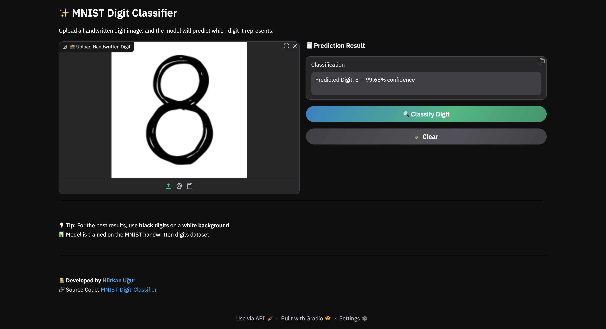

# 📚 MNIST Handwritten Digit Classifier

## 📖 Overview
This project predicts **handwritten digit classes (0–9)** using the **MNIST dataset** and a convolutional neural network (**CNN**) built with **PyTorch**. It demonstrates a full machine learning pipeline from data loading to inference, including:

- 🧠 **CNN** with stacked convolutional layers, **Batch Normalization**, **Max Pooling**, **LeakyReLU** activation, and **Dropout**  
- ⚖️ **Cross-Entropy Loss** for multi-class classification  
- 🚀 **Adam optimizer** for gradient updates  
- 🔀 **Mini-batch training** with `DataLoader`  
- 📊 **Train/Validation/Test split** for robust evaluation  
- 📈 **Live training & validation loss monitoring**  
- ✅ **Softmax activation** on the output for probability distribution across 10 classes
- 🎨 **Interactive Gradio Interface** for real-time prediction

---

## 🖼️ Application Screenshot

Below is a preview of the **Gradio Interface** used for real-time classification:



---

## 🧩 Libraries
- **PyTorch** – model, training, and inference  
- **pandas** – data handling  
- **matplotlib** – loss visualization  
- **pickle** – saving/loading normalization params and trained model
- **Gradio** — interactive web interface for real-time model demos 

---

## ⚙️ Requirements

- Python **3.13+**
- Recommended editor: **VS Code**

---

## 📦 Installation

- Clone the repository
```bash
git clone https://github.com/hurkanugur/MNIST-Digit-Classifier.git
```

- Navigate to the `MNIST-Digit-Classifier` directory
```bash
cd MNIST-Digit-Classifier
```

- Install dependencies
```bash
pip install -r requirements.txt
```

---

## 🔧 Setup Python Environment in VS Code

1. `View → Command Palette → Python: Create Environment`  
2. Choose **Venv** and your **Python version**  
3. Select **requirements.txt** to install dependencies  
4. Click **OK**

---

## 📂 Project Structure

```bash
assets/
├── app_screenshot.png                # Screenshot of the application
└── 1, 2, 3 ... 9.png                 # Digit samples

data/
└── MNIST                             # MNIST dataset

model/
└── mnist_digit_classifier.pth        # Trained model

src/
├── config.py                         # Paths, hyperparameters, split ratios
├── dataset.py                        # Data loading & preprocessing
├── device_manager.py                 # Selects and manages compute device
├── train.py                          # Training pipeline
├── inference.py                      # Inference pipeline
├── model.py                          # Neural network definition
└── visualize.py                      # Training/validation plots

main/
├── main_train.py                     # Entry point for training
└── main_inference.py                 # Entry point for inference

requirements.txt                      # Python dependencies
```

---

## 📂 Model Architecture

```bash
Input (1×28×28)

Conv Block 1:
  → Conv2d(in_channels=1, out_channels=32, kernel_size=3, stride=1, padding=1, padding_mode="reflect")
  → BatchNorm2d(32)
  → ReLU
  → MaxPool2d(kernel_size=2, stride=2)
  → Dropout(0.25)

Conv Block 2:
  → Conv2d(in_channels=32, out_channels=64, kernel_size=3, stride=1, padding=1, padding_mode="reflect")
  → BatchNorm2d(64)
  → ReLU
  → MaxPool2d(kernel_size=2, stride=2)
  → Dropout(0.25)

Fully Connected:
  → Flatten
  → Linear(64×7×7, 128)
  → ReLU
  → BatchNorm1d(128)
  → Dropout(0.5)
  → Linear(128, 10)
  → Softmax(Output)
```

---

## 📂 Train the Model
Navigate to the project directory:
```bash
cd MNIST-Digit-Classifier
```

Run the training script:
```bash
python -m main.main_train
```
or
```bash
python3 -m main.main_train
```

---

## 📂 Run Inference / Make Predictions
Navigate to the project directory:
```bash
cd MNIST-Digit-Classifier
```

Run the app:
```bash
python -m main.main_inference
```
or
```bash
python3 -m main.main_inference
```
